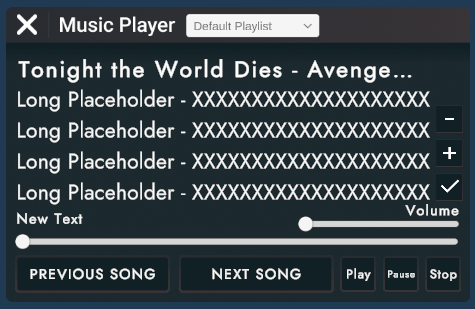

## Contact Me
* [hello@casorama.xyz](mailto:hello@casorama.xyz)
* [Discord: casorama](https://discord.gg/27bVvzE9)

## Introduction
Hey, I'm [Caso](https://rec.net/user/Caso)! I've been creating in Rec Room for the better part of 2 years and I have used that time to refine my knowledge enough to begin accepting commissions. My scope of knowledge is pretty broad, but I really enjoy making circuits with a lot of user interaction (like an arcade machine, or custom user interface).

I've worked on a few different [rooms](https://rec.net/user/Caso/rooms):
* [GoldenHour.GoldenHourOG by jollybeannn](https://rec.net/room/GoldenHour)
* [DreamDen by Caso](https://rec.net/room/DreamDen/)
* [CampCozy2.0 by SodaSpill](https://rec.net/room/CampCozy2.0/)
* [FactoryTycoon.Arena by DORM](https://rec.net/room/FactoryTycoon)
* [FindTheButton by DORM](https://rec.net/room/FindTheButton)
  
  
I mainly accept payment via CashApp or PayPal.

## Services Offered
#### ✅ Whole Room Circuits
* Pricing: *Variable.* Minimum is $100--after your project proposal you will be given an accurate quote. Half of the provided quote is expected to begin work.
* Previous works:  
  * [FactoryTycoon.Arena by DORM](https://rec.net/room/FactoryTycoon)
  * [FindTheButton by DORM](https://rec.net/room/FindTheButton)
 

#### ❌ Custom Studio Worldspace UI - Not Accepting
* Pricing: *Variable.* Minimum is $25--after your proposal you will be given an accurate quote. Half of the provided quote is expected to begin work, the rest is expected after the commissioner gets a chance to test and is satisfied with the work.
* Previous works:
  * [DreamDen by Caso](https://rec.net/room/DreamDen/)
      
    
  * [CampCozy2.0 by SodaSpill](https://rec.net/room/CampCozy2.0/)

    

#### ✅ Small Inventions 
* Pricing: *Fixed rate.* $0.10 / chip, >120 chips
* Previous works:
  * [Western Target Practice by Caso](https://rec.net/invention/11029918)

#### ✅ Medium Inventions
* Pricing: *Fixed rate.* $0.08 / chip, <120 chips, >500 chips

#### ✅ Large Inventions
* Pricing: *Variable.* Minimum is $40--requires proposal to be given an accurate quote, <500 chips
 
