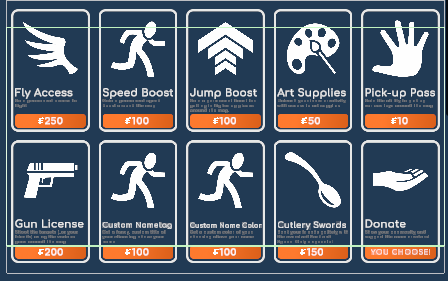

## Contact Me
* [hello@casorama.xyz](mailto:hello@casorama.xyz)
* [Discord: casorama](https://discord.gg/27bVvzE9)

## Introduction
Hey, I'm [Caso](https://rec.net/user/Caso)! I've been creating in Rec Room for the better part of 2 years and I have used that time to refine my knowledge enough to begin accepting commissions. My scope of knowledge is pretty broad, but I really enjoy making circuits with a lot of user interaction (like an arcade machine, or custom user interface).

I've worked on a few different [rooms](https://rec.net/user/Caso/rooms):
* [GoldenHour.GoldenHourOG by jollybeannn](https://rec.net/room/GoldenHour)
* [DreamDen by Caso](https://rec.net/room/DreamDen/)
* [CampCozy2.0 by SodaSpill](https://rec.net/room/CampCozy2.0/)
* [FactoryTycoon.Arena by DORM](https://rec.net/room/FactoryTycoon)
* [FindTheButton by DORM](https://rec.net/room/FindTheButton)
  
  
I mainly accept payment via CashApp or PayPal.

## Services Offered
#### ❌ Whole Room Circuits - Not Accepting
* Pricing: *Variable.* Minimum is $100--after your project proposal you will be given an accurate quote. Half of the provided quote is expected to begin work.
* Previous works:  
  * [FactoryTycoon.Arena by DORM](https://rec.net/room/FactoryTycoon) - Commissioned 
  * [FindTheButton by DORM](https://rec.net/room/FindTheButton) - Commissioned
 

#### ✅ Custom Studio Worldspace UI
* Pricing: *Variable.* Minimum is $25--after your proposal you will be given an accurate quote. Half of the provided quote is expected to begin work, the rest is expected after the commissioner gets a chance to test and is satisfied with the work.
* Previous works:
  * [DreamDen by Caso](https://rec.net/room/DreamDen/) - Not Commissioned 
      
    
  * [CampCozy2.0 by SodaSpill](https://rec.net/room/CampCozy2.0/) - Not Commissioned 

    

#### ✅ Inventions
* The first 120 chips of the invention will retain the $0.10 pricing, but additional chips past that will be at $0.08.  

| Chips | Pricing |
|:-------------|---------:|
|Less than 120|$0.10 / chip|
|Greater than 120|$0.08 / chip|  
 
  
Example of a 130 chip invention:  
| Chips | Pricing |
|---------|---------|
| 120 @ $0.10 / chip | $12 |
| 10 @ $0.08 / chip | $0.80 |
| $12 + $0.80 | $12.80 |

* Previous Works:
  * [Western Target Practice by Caso](https://rec.net/invention/11029918) - Not Commissioned 
