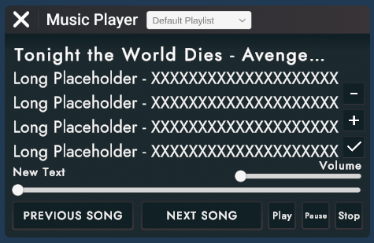

### About Me
My name is Caso and I've been creating on a more advanced level for the better part of 1-2 years, though my interest for circuitry started a bit after I started the game 4 years ago. I have a passion for circuitry and generally creating user-facing systems. I love designing and implementing UIs and am capable of creating individual art assets for these UIs. 

### Rooms / Projects
* [DreamDen](https://rec.net/room/DreamDen)
  * Spearheaded / lead the development of this room, sole maintainer whenever I find the time. Created a generally comprehensive music player and other various circuits systems.
* [CampCozy2.0](https://rec.net/room/CampCozy2.0)
  * Lead development on the circuits side of things, designed and implemented a fully comprehensive, multi-functional storefront and economy system in the room, including a subscription system. 
* [FactoryTycoon (Arena subroom)](https://rec.net/room/FactoryTycoon/) - Commissioned
  * Provided functionality to the entire arena subroom, which included multiple guns, a basic game loop, and many other things.
* [FindTheButton](https://rec.net/room/FindTheButton/) - Commissioned
  * Developed all circuits and functionality under a tight deadline 
* [GoldenHour (OG subroom)](https://rec.net/room/GoldenHour/) - Contributor
  * Assisted in basic circuitry
 
### UIs

^DreamDen Music Player  
  
  

^CampCozy2.0 Storefront - note: I did *not* design the actual iconography for the storefront, only designed the functional aspects of it.

  

## Various UI icons / general GFX

Graphic I made for a series of art workshops I may or may not host at some point.  
  
  

Individual canvas graphic, all made by me..with the exception of the RecRoom logo, of course.

